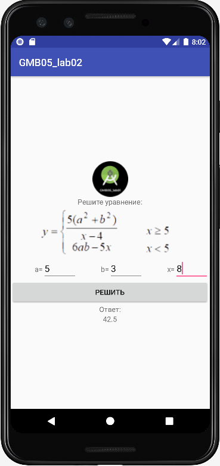

# GMB05_lab02_AndroidStudio
Practical work 2. In the discipline of Mobile application development



Обработчик на события нажатий клавиш
```
View.OnKeyListener myKeyListener = new View.OnKeyListener() {
            @Override
            public boolean onKey(View view, int i, KeyEvent keyEvent) {
                if (editText_a.getText().toString().trim().equals("") ||
                        editText_b.getText().toString().trim().equals("") ||
                editText_x.getText().toString().trim().equals(""))  {
                    button.setEnabled(false);
                } else {
                    button.setEnabled(true); 
                }
                return false;
            }
        };
        button.setEnabled(false); 
        editText_a.setOnKeyListener(myKeyListener); 
        editText_b.setOnKeyListener(myKeyListener); 
        editText_x.setOnKeyListener(myKeyListener);
```


Teacher: https://github.com/proffix4
